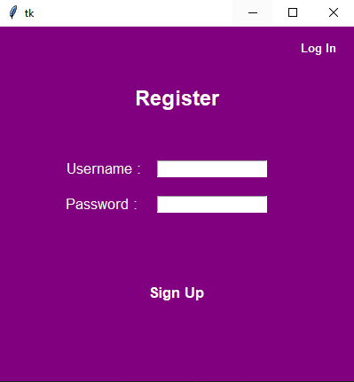
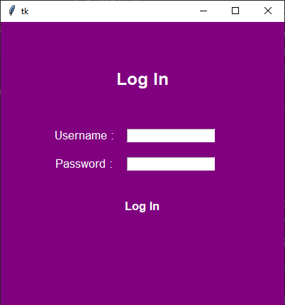
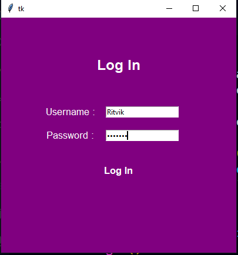
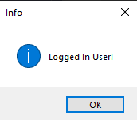

# Secured-Login-System
In this project I made a secured login system.

## Files
[188.py](./188.py) is made first  
[189.py](./189.py) then this is made.

### The Files are provided in the repository

## Proccess
The User Opens a window  

user clicks to login

user enters details

then is a success

